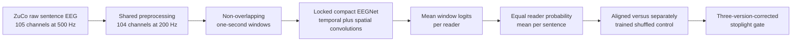

# V2 raw-EEG EEGNet screen

V2 is the first of three broad follow-ups authorized after the inconclusive V1
frozen NeuroLM probe. It deliberately bypasses NeuroLM. The question is whether
local spatiotemporal EEG contains any alignment-specific sentiment signal that a
compact learned raw-signal model can recover.

## End-to-end flow

## Locked protocol

| Component | V2 choice | Reason |
| --- | --- | --- |
| Input | Preprocessed raw voltages | Tests the signal without relying on cross-domain NeuroLM transfer |
| Montage | Native 104 retained EGI channels | NeuroLM's approximate channel-name mapping is unnecessary |
| Window | Non-overlapping one-second segments | Matches the shared 200 Hz preprocessing and keeps the model compact |
| Normalization | Per-channel mean/std fitted only on inner-training recordings | Prevents held-out sentences from setting normalization statistics |
| Model | One EEGNet-style temporal/spatial convolutional network | Tests local learned structure with a bounded parameter count |
| Training row | One reader recording containing all its windows | Avoids pretending correlated windows are independent examples |
| Sentence weight | Equal total loss per sentence, with training-fold class balancing | Prevents longer sentences or sentences with more readers from dominating |
| Test aggregation | Mean window logits per reader, then equal mean reader probabilities | Produces one prediction per independent sentence |
| Splitting | Five sentence-stratified folds for seeds 42, 52 and 62 | Keeps every reader and window of a sentence in one fold |
| Selection | Fixed inner validation split used only for early stopping | Selects an epoch without searching architectures or learning rates |
| Hyperparameter search | None | This is a broad screen, not a tuning exercise |

The model configuration is fixed in `RawEEGNetConfig`. Changing its filters,
kernel sizes, dropout, optimizer, learning rate, window size, or training budget
after examining V2 results would create an unplanned extra version.

## Controls

| Setup | Training | Test input | Role |
| --- | --- | --- | --- |
| `raw_eegnet` | Correct EEG/sentence pairing | Correct pairing | Primary aligned model |
| `raw_eegnet_shuffled` | Whole reader bundles permuted within each split | Independently permuted bundles | Primary negative control |
| `raw_eegnet_temporal_block_shuffle` | Reuses the aligned model | 50 ms blocks permuted inside each one-second window | Secondary temporal-order diagnostic |
| `majority` | Training-fold class prior | No EEG | Minimum reference |

The temporal-block control is diagnostic only. Its distribution is deliberately
perturbed at inference, so it does not enter the primary viability gate. The
primary comparison is always aligned versus the separately trained split-local
shuffled-pairing model.

## Stoplight gate

V2 is green only if every criterion is true:

| Criterion | Required value |
| --- | ---: |
| Mean aligned balanced accuracy | Greater than 1/3 |
| Mean aligned macro-F1 | Greater than majority macro-F1 |
| Mean aligned minus shuffled macro-F1 | At least +0.015 |
| Seeds with positive aligned-minus-shuffled OOF delta | At least 2 of 3 |
| 98.33% paired-bootstrap lower bound | Greater than 0 |

- **Green:** eligible for tuning only after V2-V4 are all complete.
- **Yellow:** all criteria except the corrected interval pass; record without tuning.
- **Red:** do not tune V2.

The 98.33% interval controls the three newly planned exploratory versions as one
screening family. A winning screen still needs an independently locked
confirmation before supporting a strong scientific claim.

## Resumption and storage

The dedicated notebook is
[`notebooks/neurolm_raw_eegnet_v2_colab.ipynb`](notebooks/neurolm_raw_eegnet_v2_colab.ipynb).
It does not download NeuroLM or another model checkpoint.

Preprocessing writes one atomic float16 pack per subject under
`CachedArtifacts/eeg_tokenizer/neurolm/raw_eeg_packs_v2`. Completed subjects are
reused after a disconnect. The expected Drive footprint is roughly 1-3 GB; the
range is uncertain because compressed size depends on the actual sentence
durations and signal compressibility.

Evaluation writes metrics, predictions, histories, and completion markers after
every setup/fold. A resumed runtime skips only folds whose result rows and marker
are both complete. Canonical outputs are written under
`Results/eeg_tokenizer/neurolm/raw_eegnet_v2`; V1 is never overwritten.
