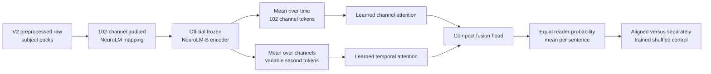

# V3 structured frozen-NeuroLM probe

V3 is the second of the three authorized broad follow-ups. It does not depend on
V2's score. It tests a specific alternative explanation for V1: the frozen
NeuroLM representation may contain useful information that was erased when all
channel/time embeddings were reduced to global mean, standard deviation, and
slope values.

## End-to-end flow

## Representation choice

The full frozen encoder output is `seconds × 102 channels × 768 values`. Saving
that tensor for every reader would be unnecessarily large. V3 keeps two
complementary views:

| View | Shape per reader | Preserves | Averages away |
| --- | --- | --- | --- |
| Channel tokens | `102 × 768` | Electrode identity and spatial variation | Within-channel temporal variation |
| Time tokens | `seconds × 768` | Sentence progression and duration | Within-second spatial variation |

This factorized representation preserves much more organization than V1 while
keeping the expected float16 cache around 0.7-1.0 GB. The estimate varies with
recording length and compression. It does not preserve exact channel-by-time
interactions; that is a deliberate resource boundary, not an accidental claim.

## Locked protocol

| Component | V3 choice |
| --- | --- |
| Input | Factorized channel and per-second NeuroLM-B embeddings |
| NeuroLM encoder | Official checkpoint, entirely frozen |
| Mapped channels | Same 102 assignments accepted by V1's 30-degree policy |
| Projection | One shared `768 → 96` learned projection |
| Spatial aggregation | Learned attention over 102 channel tokens with learned channel positions |
| Temporal aggregation | Learned attention over padded second tokens with fixed sinusoidal positions |
| Fusion | Channel summary, time summary, absolute difference, and elementwise product |
| Probe size | Approximately 133k trainable parameters; exact value printed by the smoke test |
| Training row | One reader recording |
| Sentence weighting | Equal total loss per sentence plus training-fold class balance |
| Test aggregation | Equal mean of reader probabilities |
| Evaluation | Five sentence-stratified folds for seeds 42, 52 and 62 |
| Selection | One inner validation split for early stopping only |
| Hyperparameter search | None |

The shared projection, attention size, dropout, optimizer, learning rate, and
training budget are fixed in `StructuredProbeConfig`. They are not changed after
V2 or V3 results are inspected.

## Controls

| Setup | Purpose |
| --- | --- |
| `structured_neurolm_probe` | Correctly aligned structured NeuroLM features |
| `structured_neurolm_probe_shuffled` | Independent model with whole reader bundles permuted within train, validation, and test splits |
| `structured_neurolm_structure_shuffle` | Aligned model evaluated after independently permuting channel identity and time order |
| `majority` | Training-fold class-prior prediction |

The structure shuffle is an inference-only diagnostic and does not enter the
primary gate. It can indicate whether a successful aligned model relies on
channel/time organization, but a drop can partly reflect distribution shift.

## Stoplight gate

V3 is green only when all five conditions pass:

| Criterion | Required value |
| --- | ---: |
| Mean aligned balanced accuracy | Greater than 1/3 |
| Mean aligned macro-F1 | Greater than majority macro-F1 |
| Mean aligned minus shuffled macro-F1 | At least +0.015 |
| Positive aligned-minus-shuffled seeds | At least 2 of 3 |
| 98.33% paired-bootstrap lower bound | Greater than 0 |

- **Green:** eligible for later tuning only after V4 completes.
- **Yellow:** suggestive; record without tuning.
- **Red:** do not tune V3.

## Running and resumption

Use
[`notebooks/neurolm_structured_probe_v3_colab.ipynb`](notebooks/neurolm_structured_probe_v3_colab.ipynb).
V2 must first finish its raw-cache cell; V2 evaluation does not need to finish.

V3 reads `raw_eeg_packs_v2`, reuses the existing NeuroLM-B checkpoint, and
writes one atomic structured pack per subject to `structured_features_v3`.
Extraction can resume at subject granularity. Evaluation saves partial metrics,
predictions, histories, and completion markers after every setup/fold under
`structured_probe_v3`.
