# V4 frozen NeuroLM/GPT-2 verbalizer

V4 is the final predeclared broad screen. It tests whether the complete
NeuroLM-B EEG-to-GPT-2 route exposes sentiment information that V1's fixed
pooling and V3's separate channel/time summaries missed.

## End-to-end flow

```mermaid
flowchart LR
    A["V2 preprocessed raw EEG"] --> B["102-channel audited mapping"]
    B --> C["Start/middle/end seconds"]
    C --> D["Official full frozen NeuroLM-B"]
    D --> E["Fixed sentiment instruction"]
    E --> F["Final GPT-2 prompt state"]
    F --> G["32-unit residual adapter"]
    G --> H["Fixed GPT-2 label tokens"]
    H --> I["Reader probabilities averaged per sentence"]
    I --> J["Aligned versus shuffled-pairing gate"]
```

## Locked choices

| Component | V4 choice |
| --- | --- |
| Input | Raw paper-preprocessed ZuCo EEG; no stimulus sentence text |
| Time coverage | At most three seconds chosen deterministically as start/middle/end |
| Full model | Official NeuroLM-B checkpoint, including its GPT-2 route |
| Frozen weights | Neural tokenizer, GPT-2, and label-token embeddings |
| Instruction | One identical fixed prompt for every recording |
| Labels | Single GPT-2 tokens ` negative`, ` neutral`, ` positive` |
| Trainable part | Residual `768 → 32 → 768` adapter plus three biases (~49k parameters) |
| Reader handling | Reader rows during training; equal probability mean at held-out sentence level |
| Evaluation | Five sentence-stratified folds for seeds 42, 52 and 62 |
| Search | No prompt, label-word, architecture, or optimizer search |

The three-second limit keeps the high-density 102-channel EEG prefix and fixed
instruction comfortably inside GPT-2's 1,024-token context. It also prevents a
large full-model cache. For recordings longer than three seconds, the selected
seconds cover the start, middle, and end; this is a declared resource boundary.

The frozen full model is executed once per reader recording. Only the final
prompt-position state and the three fixed GPT-2 token vectors are cached. The
small adapter is then trained independently inside each fold. This makes GPT-2
part of the classifier while avoiding repeated full-model fine-tuning.

## Controls and decision

The primary control independently permutes whole reader bundles within the
training, validation, and test sentence sets and trains a new adapter. The
majority baseline is also reported. The prompt never contains the sentence that
elicited the EEG, preventing text sentiment from leaking into the prediction.

V4 uses the same five-part stoplight gate as V2 and V3: balanced accuracy above
chance, macro-F1 above majority, aligned-minus-shuffled macro-F1 of at least
`+0.015`, at least two positive seeds, and a positive lower bound of the 98.33%
paired-bootstrap interval.

- **Green:** eligible for a separately locked confirmation.
- **Yellow:** record without tuning.
- **Red:** stop the broad screen.

Run [`notebooks/neurolm_gpt2_verbalizer_v4_colab.ipynb`](notebooks/neurolm_gpt2_verbalizer_v4_colab.ipynb).
V4 reuses `raw_eeg_packs_v2`, the existing checkpoint, and the pinned official
source. Its cache is isolated under `gpt2_prompt_features_v4`, with results under
`gpt2_verbalizer_v4`.
