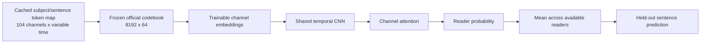

# V2 frozen token-map probe

V2 is the first of three predeclared follow-ups after the failed histogram
baseline. It asks whether V1 failed because averaging token counts discarded
temporal order and electrode identity.

The Colab notebook reads the frozen codebook tensor directly from the official
checkpoint. It does not instantiate the V1 tokenizer, preprocess raw EEG, rerun
token extraction, or install the tokenizer-inference dependency set.

## Fixed protocol

| Item | Predeclared value |
| --- | --- |
| Independent evaluation unit | sentence |
| Training rows | subject/sentence recordings |
| Reader aggregation | mean probability at test time |
| TFM tokenizer and codebook | frozen |
| Trainable classifier | two temporal convolutions, channel attention, linear head |
| Outer evaluation | 5 folds, seeds 42/52/62 |
| Validation | 15% of outer-training sentences only |
| Maximum epochs / patience | 15 / 3 |
| Batch size | 32 |
| Optimizer | AdamW, LR 3e-4, weight decay 1e-2 |
| Null control | separately shuffled train, validation, and test sentence bundles |
| Multiple-version correction | 98.33% paired bootstrap interval |

All reader recordings for a sentence remain in the same outer fold. Each
sentence receives equal total loss weight, then inverse class-frequency weight;
sentences with more valid readers therefore cannot dominate training.

The same ZuCo readers contribute different sentences to training and test
folds. V2 therefore measures generalization to unseen sentences for the known
reader pool; it is not an unseen-subject evaluation. Holding out only subjects
would leak sentence labels because the remaining readers saw the same texts,
while jointly holding out subjects and sentences would be a different planned
experiment.

The model sees learned channel-position vectors and local temporal token
patterns. It does not see text, sentence ID, subject ID, raw EEG, V1 labels from
held-out folds, or a trainable TFM codebook.

## Gate and stopping rule

V2 passes only when all criteria hold:

- aligned balanced accuracy is above `1/3`;
- aligned minus shuffled macro-F1 is at least `0.015`;
- at least two of three split seeds have positive deltas;
- the family-wise corrected paired bootstrap lower bound is above zero;
- aligned macro-F1 exceeds majority macro-F1.

V2 is one fixed version, not a search space. A scientific failure advances only
to the already predeclared V3 frozen-encoder probe. Changing seeds, architecture,
pooling, filtering, thresholds, or the checkpoint would define an unplanned
experiment and is outside this version.

## Resumption and outputs

The evaluator writes prediction and history tables before committing each
setup/fold metric row. On restart it verifies a signature over the token-cache
index, frozen codebook, and configuration, then skips completed work. It refuses
to mix incompatible partial results in one folder.

Final outputs include fold metrics, sentence-level out-of-fold probabilities,
training histories, configuration, cache/codebook audit reports, corrected
bootstrap interval, viability decision, and a per-seed comparison figure.
