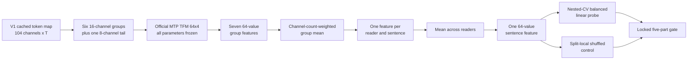

# V3 frozen-encoder probe

V3 is the third and final experiment in the predefined TFM transfer sequence.
It asks whether the official pretrained TFM encoder can recover information that
was unavailable to the V1 histogram and the small V2 token-map classifier.

## End-to-end flow

## Fixed protocol

| Component | V3 choice | Why |
| --- | --- | --- |
| EEG input | Existing V1 discrete token maps | Avoids repeating raw-data preprocessing and tokenizer inference |
| Encoder | Official TFM 64x4 with the MTP checkpoint | Tests the authors' learned contextual representation |
| Frozen parameters | Every TFM parameter | Keeps this a transfer probe rather than a large fine-tuning search |
| Removed component | Checkpoint classification head | It belongs to the pretraining tasks, not ZuCo sentiment |
| Feature tap | 64 values immediately before that head | Uses the pretrained encoder output without modifying upstream source |
| Montage adapter | Consecutive groups: 16, 16, 16, 16, 16, 16, 8 channels | Uses all 104 channels while staying below the official 2,048-token limit |
| Group aggregation | Mean weighted by 16/8 channel count | Prevents the eight-channel tail from receiving the same weight as a full group |
| Reader aggregation | Mean of reader features for each sentence | Makes the independent evaluation row the sentence, as in V1 |
| Probe | StandardScaler + balanced L2 logistic regression | A low-capacity test of linearly available sentiment information |
| Probe selection | Inner 3-fold search over C = 0.01, 0.1, 1, 10 | Selects regularization without looking at the outer test fold |
| Evaluation | Five stratified outer folds; seeds 42, 52, 62 | Same unseen-sentence protocol used by the previous versions |
| Negative control | Features independently permuted inside each train and test fold | Breaks EEG/sentence alignment without changing feature values or label balance |
| Baseline | Training-fold class-prior classifier | Shows the score available without EEG features |

## What is trained

Only the logistic-regression coefficients and intercept are fitted. The official
TFM token embedding, four Transformer layers, and every other encoder parameter
remain unchanged. Standardization is also fitted only on each training fold via
the scikit-learn pipeline, so the held-out fold does not determine its means or
variances.

The reader mean happens before cross-validation. This is safe for the declared
question because a sentence and all of its reader recordings are assigned to one
fold. It tests unseen sentences from the known pool of ZuCo readers. It does not
test transfer to an unseen person.

## Resumption and resource behavior

The notebook first reuses the 12 packed V2 token-cache shards. Frozen encoding is
saved as one atomic `.npz` shard per subject under `encoder_features_v3`. A
disconnection can therefore lose only the subject currently being processed.
Rerunning all cells verifies the dataset fingerprint, checkpoint hash, and
configuration before reusing a subject shard.

The complete float32 feature array is about 4,532 x 64 x 4 bytes, or 1.1 MiB.
The 400 sentence features are about 0.1 MiB. The compact token maps dominate host
memory, but they already fit V2 after the packed `uint16` fix. GPU memory is used
in small batches and does not hold the entire dataset.

The first run can take a while because roughly 4,532 recordings pass through the
encoder in seven channel groups. Later runs should be much faster because only
the small linear probes need to be refitted once all 12 subject shards exist.

## Locked decision rule

V3 passes only if every criterion below is true:

| Criterion | Required value |
| --- | ---: |
| Mean aligned balanced accuracy | Greater than 1/3 |
| Mean aligned minus shuffled macro-F1 | At least +0.015 |
| Seeds with positive aligned-minus-shuffled delta | At least 2 of 3 |
| Three-version-corrected paired bootstrap lower bound | Greater than 0 |
| Mean aligned macro-F1 | Greater than majority macro-F1 |

The bootstrap interval is 98.33%, reflecting the familywise 0.05 error budget
across the three planned versions. Passing would justify treating frozen TFM
representations as useful for this transfer setting. Failing ends this bounded
sequence; it does not trigger a V4 or post-hoc hyperparameter search.

## Interpretation boundaries

- Results concern three-way sentence sentiment, not the clinical tasks used to
  develop TFM.
- The encoder sees token IDs produced from ZuCo, whose device, montage, subjects,
  and task differ from its training domains.
- Consecutive channel grouping is a deterministic adapter, not a learned montage
  mapping. It is necessary because all 104 channels at once would exceed the
  official sequence-length limit.
- Mean pooling deliberately discards reader-specific variation after encoding.
  That matches the sentence-level research question but cannot support a claim
  about individual readers.
